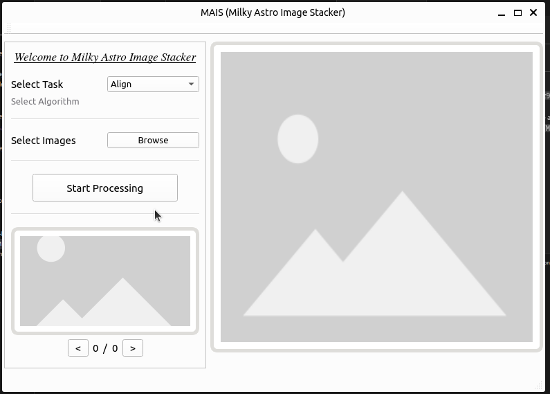
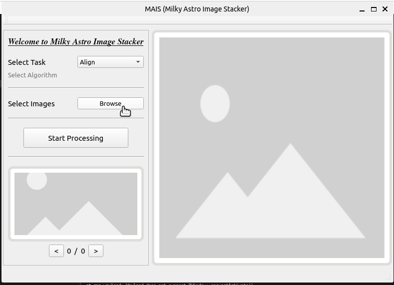
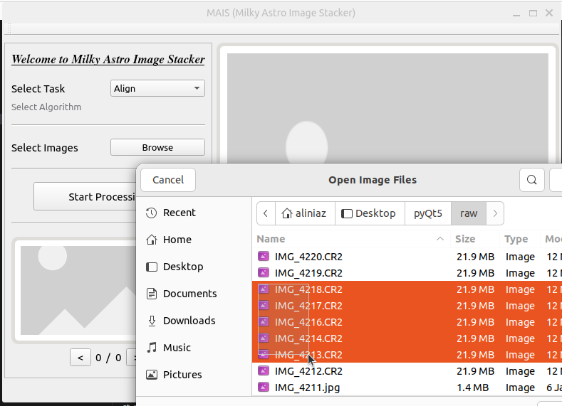
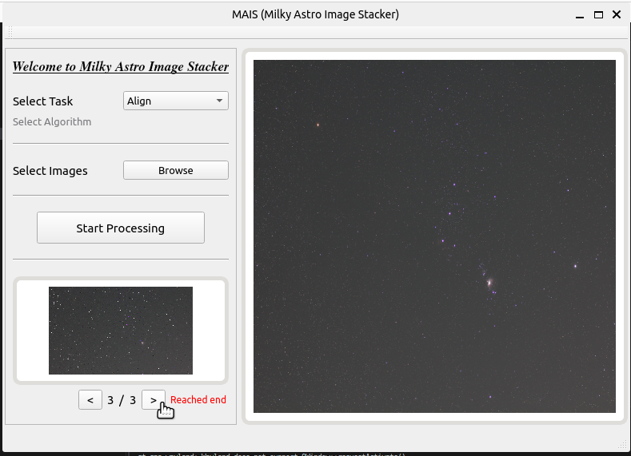
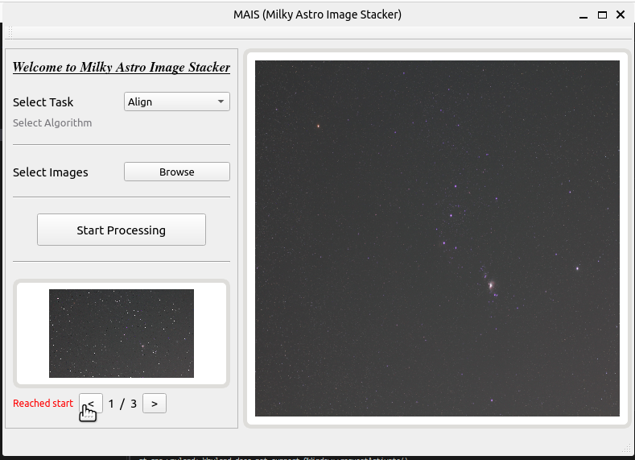
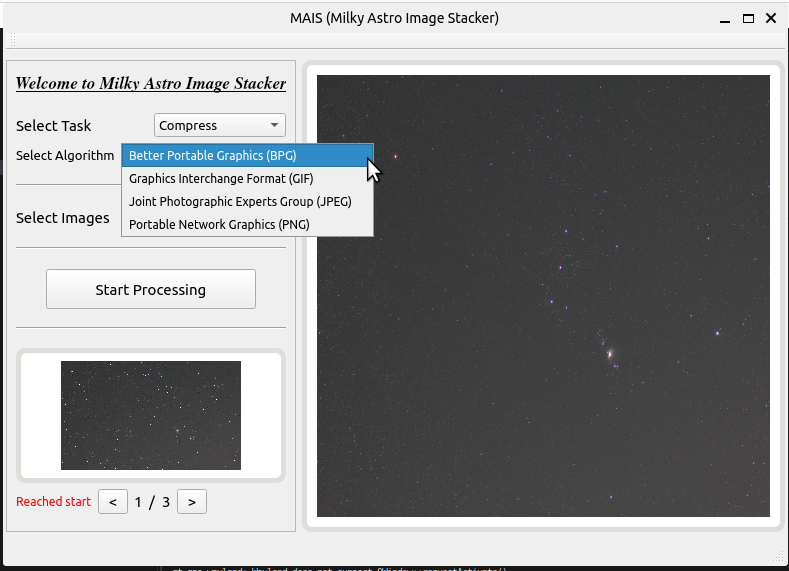
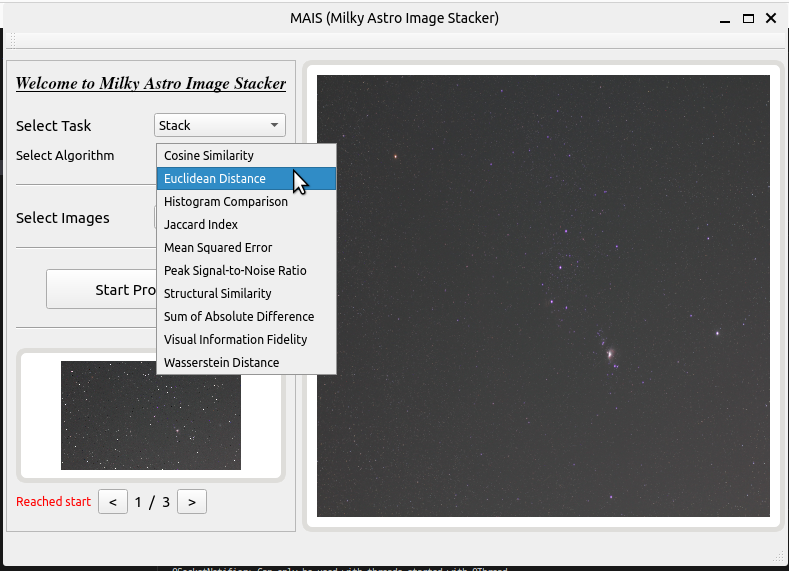

# Milky Astro Image Stacker
## Getting Started
- Download as zip from the repo, or
- Using `git clone https://github.com/AliNiaz990487/pyQt5` 
- Navigate to the location `pyQt5/MAIS`
- run `pip -r requirements.txt`(make sure you are at `pyQt5/MAIS`)
- run `python main.py` (make sure you are at `pyQt5/MAIS`)
- you should be able to see....

## Features
- Responsive UI
- Multithreaded
- Can work with bulk of RAW images
- Cache the RAW images for efficient display
- Align `.CR2` 
- Stack `.tif`
- Compress `.CR2, .tif` to `JPEG, PNG, GIF` 

## Usage

<table>
<tr>
<td></td>
<td></td>
</tr>
<tr>
<td></td>
<td></td>
</tr>
<tr>
<td></td>
<td></td>
</tr>

</table>